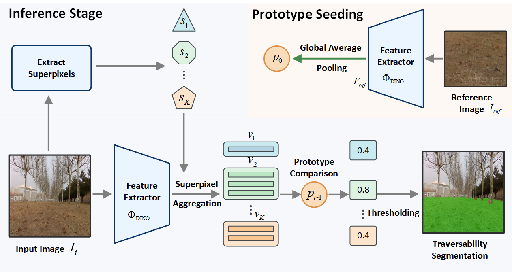

# TARTS: Training-free Adaptive Reference-guided Traversability Segmentation

[](LICENSE)
[](https://docs.ros.org/en/humble/)
[](https://www.python.org/)

## Overview

**TARTS** (Training-free Adaptive Reference-guided Traversability Segmentation) is a novel framework for real-time terrain segmentation using a single reference image. The system combines DINOv3 Vision Transformer features with SLIC superpixel segmentation to achieve robust traversability perception without requiring extensive training datasets.

### Key Features

- **Training-free Deployment**: Initializes from a single reference image of desired traversable terrain
- **Online Adaptation**: Continuously refines prototypes through trajectory-guided self-supervision
- **Real-time Performance**: Achieves 17-24 FPS on NVIDIA Jetson Orin NX embedded platform
- **Robust Segmentation**: Outperforms state-of-the-art supervised methods on challenging benchmarks

### System Architecture

The TARTS framework consists of three main components:

1. **One-shot Prototype Seeding**: Establishes initial traversability prototype from a reference image using pre-trained DINOv3 features
2. **Segmentation Inference**: Performs real-time segmentation via superpixel-based feature aggregation and adaptive thresholding
3. **Online Adaptation Loop**: Refines prototypes using automated footprint supervision from robot trajectory



*Figure: TARTS segmentation inference pipeline showing feature extraction, superpixel aggregation, and similarity-based classification.*

## Demo Videos

| Demo 1 | Demo 2 |
|--------|--------|
|  |  |

| Demo 3 | Demo 4 |
|--------|--------|
|  |  |

## Abstract

Autonomous mobile robots require robust traversability perception to navigate safely in diverse outdoor environments. However, traditional deep learning approaches are data-hungry and struggle to adapt quickly to unseen environments. TARTS introduces a novel framework combining one-shot prototype initialization with trajectory-guided online adaptation for terrain segmentation.

Using a single reference image, TARTS establishes an initial prototype from pre-trained DINO Vision Transformer (ViT) features. The system performs segmentation through superpixel-based feature aggregation and valley-emphasis Otsu thresholding, while continuously refining the prototype via Exponential Moving Average (EMA) updates driven by automated footprint supervision from the robot's traversed trajectory.

## Installation

### Prerequisites

- Ubuntu 22.04 (or compatible)
- ROS2 Humble
- Python 3.10 (required by ROS2 Humble)
- CUDA 11.0+ (optional, for GPU acceleration)

### Dependencies

Install required Python packages:

```bash
pip install -r requirements.txt
```

### Build Instructions

1. Clone the repository into your ROS2 workspace:

```bash
cd ~/ros2_ws/src
git clone https://github.com/Yinmlmaoliang/TARTS.git
```

2. Set up Python path for `tarts_core`:

```bash
export PYTHONPATH=/path/to/TARTS:$PYTHONPATH
# Add to ~/.bashrc for persistence
echo 'export PYTHONPATH=/path/to/TARTS:$PYTHONPATH' >> ~/.bashrc
```

3. Build the ROS2 packages:

```bash
cd ~/ros2_ws
colcon build --packages-select tarts_msgs tarts_ros
source install/setup.bash
```

## Usage

### 1. Register a Prototype

Before segmentation, register a traversable terrain prototype from a reference image:

```bash
ros2 run tarts_ros tarts_register_prototype \
  --image /path/to/reference_image.jpg \
  --class_name my_terrain \
  --device cuda
```

**Parameters:**
- `--image`: Path to reference image showing desired traversable terrain
- `--class_name`: Identifier for the terrain class (e.g., grass, asphalt, dirt)
- `--device`: Computation device (`cuda` or `cpu`)

Prototypes are saved to `~/.ros/tarts_prototypes/{class_name}.pt`

### 2. Run Segmentation (Static Mode)

For basic segmentation with a fixed prototype:

**Using launch file (recommended):**

```bash
ros2 launch tarts_ros tarts_segmentation.launch.py \
  class_name:=my_terrain \
  threshold:=0.5 \
  device:=cuda \
  image_topic:=/camera/color/image_raw
```

**Or run node directly:**

```bash
ros2 run tarts_ros tarts_segmentation \
  --ros-args \
  -p class_name:=my_terrain \
  -p threshold:=0.5 \
  -p device:=cuda \
  -p image_topic:=/camera/color/image_raw
```

**Threshold Options:**
- Fixed threshold: Set to a value between 0.0-1.0 (e.g., `threshold:=0.5`)
- Adaptive threshold: Set to `"OTSU"` to enable valley-emphasis Otsu's automatic thresholding (fixed threshold value will be ignored)

### 3. Run Online Prototype Update (Adaptive Mode)

For mobile robot navigation with continuous prototype adaptation:

```bash
ros2 launch tarts_ros tarts_online_update.launch.py \
  class_name:=my_terrain \
  threshold:=0.5 \
  momentum:=0.9 \
  update_interval:=0.5 \
  min_observation_distance:=1.0
```

**Key Parameters:**
- `threshold`: Similarity threshold (0.0-1.0) or `"OTSU"` for adaptive thresholding
- `momentum`: EMA momentum coefficient (0.0-1.0, higher = slower adaptation, default: 0.9)
- `update_interval`: Distance between prototype updates in meters (default: 0.5m)
- `min_observation_distance`: Minimum distance for footprint observation (default: 1.0m)
- `valid_projection_threshold`: Minimum ratio of valid footprint projection (default: 0.95)

This mode launches both `segmentation_node` and `prototype_update_node` for real-time adaptation using odometry-based footprint projection.

### Topics

**Subscribed:**
- `/camera/color/image_raw` (sensor_msgs/Image): Input RGB images
- `/odom` (nav_msgs/Odometry): Robot odometry (online mode only)
- `/camera/color/camera_info` (sensor_msgs/CameraInfo): Camera intrinsics (online mode only)

**Published:**
- `/tarts/mask` (sensor_msgs/Image): Binary segmentation mask
- `/tarts/visualized` (sensor_msgs/Image): Overlay visualization
- `/tarts/similarity` (std_msgs/Float32): Average similarity score
- `/tarts/prototype_updated` (std_msgs/Float32): Update notification (online mode)

## Configuration

Edit `tarts_ros/config/tarts_params.yaml` to customize parameters:

```yaml
segmentation_node:
  ros__parameters:
    class_name: "grass"
    threshold: 0.5
    device: "cuda"
    input_size: 480
    slic_n_segments: 400
    slic_compactness: 30.0
    visualization_alpha: 0.5
    debug: false
```

## Performance

- **Latency**: 41-58ms end-to-end (17-24 FPS) on Jetson Orin NX
- **RTSD Dataset**: 97.2% F-score, 94.5% IoU
- **ORFD Benchmark**: 97.0% F-score, 94.1% IoU (outperforms supervised SOTA)

## Repository Structure

```
TARTS/
├── tarts_core/              # Core segmentation engine (ROS-independent)
│   ├── models/              # DINOv3 Vision Transformer backbone
│   ├── tarts/               # Segmentation engine with SLIC + DINO
│   ├── prototype/           # Prototype feature vector management
│   └── utils/               # Image processing and visualization
├── tarts_ros/               # ROS2 wrapper package
│   ├── tarts_ros/           # Python nodes
│   │   ├── segmentation_node.py
│   │   ├── prototype_update_node.py
│   │   └── footprint_utils/
│   ├── launch/              # Launch files
│   └── config/              # YAML configuration
├── tarts_msgs/              # Custom ROS2 messages
├── media/                   # Documentation media
└── reference-code/          # Reference implementations
```

## License

This project is licensed under the MIT License - see the [LICENSE](LICENSE) file for details.

## Acknowledgments

- DINOv3 pre-trained models from [facebookresearch/dinov2](https://github.com/facebookresearch/dinov2)
- SLIC superpixel implementation from [fast-slic](https://github.com/Algy/fast-slic)
- Benchmark datasets: [ORFD](https://github.com/chaytonmin/Off-Road-Freespace-Detection)

---

**Note**: This research is currently under review. Some implementation details have been omitted pending publication.
